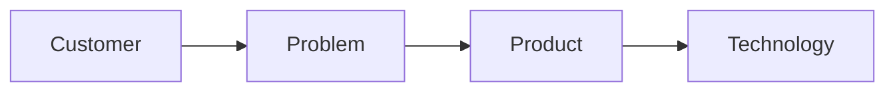
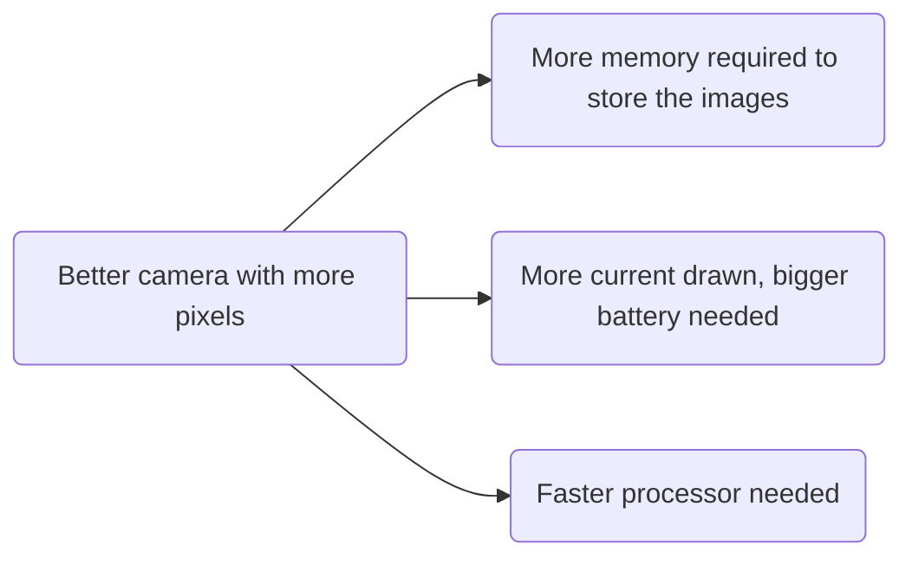

# What is "Data collection"?
- Data collection is a process where we collect and measure data from different sources.
- The goal of data collection is to use the collected data for a particular purpose.
	- Understand something
	- Perform research
	- Build products
- Our intended goal can alter what/how we collect the data.
# Scenarios under which we collect data
1. **Lab Controlled data**:
Data are recorded under the controlled condition, which doesn't necessarily reflect the real condition.
2. **In-the-wild data**:
This type of data is recorded under real conditions without any intervention to alter the environment in which data is being recorded.

**Some Notes**:
- It is generally more difficult to process (extract) information from in-the-wild datasets. The reason is they usually include noise, artifacts, and are collected with high degrees of freedom.
- If you build a system based on only lab controlled data, it is unlikely that it would generalize to (works under) real conditions. The main reason is that the system is not learning to deal with variations, and may only perform well under exact conditions.
- First generations of machine learning algorithms were usually trained using lab-controlled data. However more recent algorithms have focused on in-the-wild data too.
# Different sources for data collection
## Observation, tracking, and documentation:
- Perhaps the oldest approach
- Ancient scientists observed and monitored weather patterns, the moon, planets, etc, to extract patterns and learn things.
- They handed this information down to other generations either verbally or in text.
## Sensors:
- A sensor is defined as a specific device that produces a signal for a physical phenomenon.
- Popular sensors include accelerometer, gyroscope, temperature, ECG, EEG, and PPG sensors.
- The output of the sensors usually includes noise and artifacts.
	- Noise (and artifact) is a process which negatively affects the desired signal.
	- Examples of noise include thermal noise, white noise, motion artifact, etc.
- After collecting data from sensors, we adopt methods to decrease the noise. As the noise decreases, the quality of the collected data increases.
### Accelerometer
- Monitors acceleration in $m/s^2$ or $g$
- 3 axis (x,y,z)
- Uses "micro electro-mechanical systems" (MEMS) technology
- Very small capacitance attached to a small spring-mass system. Acceleration results in movement of the mass, i.e. changes in capacitance
- **Artifact/noise: sensitive to vibrations and movement**
### Gyroscope
- Similar concept to accelerometers
- They measure angular velocity in degrees per second or revolutions per second.
- Typically similar sampling as accelerometers, but with a range of $\pm 500 \frac{deg}{S}$
- Along with accelerometers, we can detect much more information for example regarding orientation
- **Artifact/noise: digital gyroscopes often "drift"**
### Magnetometer
- Use Hall Effect: if a conductor carrying current is placed in a magnetic field, a voltage is generated (perpendicular to both the current and the field)
- The earth has a magnetic field, therefore, the magnetometer provides additional information, which can be used (fused) to correct/enhance accelerometer and gyroscope readings
- **Artifact/noise: iron, magnets, and strong currents in the environment**
### Internet
- A variety of data either directly collected using sensors, or converted to digital formats from other sources.
- The internet is a rich source of data and therefore data is collected from the internet!
- The benefits of collecting data from the internet is that it is cheap, easy, and always accessible
- Collecting data from the internet is mainly called **web scraping** (what we did in Lab1)
- **Web Scraping**: The process in which we collect structured web data in an automated manner.
	- Examples include: Text, Images, Videos, Audio, Financial Data, Weather Data (Lab1)
# What is meta-data?
- Metadata is data that describes other data
	- data about data
- It's used to provide context or information about data or a dataset.
- It is usually stored in a separate section of the file or database, and it used to organize and categorize data
- It makes it easier to search for and locate information
	- Examples:
		- **Image** **metadata**: Information about the camera used, date the photo was taken, location, device, etc.
		- **File** **metadata**: Information about the file like its name, size, and creation date
		- **Document metadata**: Information about the author, title, subject, tags, etc.
		- **AV metadata**: Information about the artist, album, genre, and the duration of the AV file
		- **Sensor metadata**: Timestamp, sensor time, sensor location, sensor manufacturer, model, data resolution, data units, sampling rate (frequency in which data was collected)
# What are data labels?
- After or during the data collection, a process called **labelling** is done
- We put labels on things to classify them. For example, this could be labelling an image as "cat" or "not cat" or "cancer" or "no cancer".
- Labelling is not always right, this is called "label noise"
## Crowdsourcing
- Crowdsourcing is a way of collecting service/ideas/content from a large group of people.
- Crowdsourcing is good when labels may not be easy to assign, the dataset may be too large for one team, reducing workload, and easily scaling
- It leverages 'The Law of Large Numbers' which is a statistical principle stating that when the sample size of a study increases, the results of the study become more and more accurate, converging towards the true/expected value, eliminating as much label noise as possible!
## Automated
- Relying on AI to label things based on images
- It's quite cheap, but has a high label noise (likely because AI relies on its language model, and may not understand everything perfectly).
## Mixed methods
- Combination of the other methods to refine and reduce label noise.
- f.e. Using crowdsourcing first, then using AI on the items in the dataset that had a lot of ambiguity.
# Things to consider when collecting data
**Ethics**: When data collection involves humans or any living thing, we must take into account some serious considerations.
- The researcher/organization must be introduced to the participants
- The research purpose must be described to participants
- Permission must be obtained from participants
- Participants must be informed that they are free to withdraw w/o consequences
- Not permitted to cause physical or emotional harm
- Researchers must remain unbiased in data collection
- Confidentiality is applied. When this isn't possible, participants are informed where and where it doesn't apply.
- Respect the participants' time and attempt to compensate them if possible.

**Reliability and Quality**: Is the source of data reliable? How do we know?

**Size**: How much data (samples) are needed to accomplish the goal.

**Cost**: Some data are very hard to get or require specialized equipment (like neutrinos)

**Time**: Longitudinal studies (health, climate, etc) take a very long time to produce. Longer studies are more accurate but also have increased costs

**Privacy**: Data privacy refers to the protection of personal information and the rights of individuals to control the collection, use, and dissemination of their personal data. There are critical rules + ethical guidelines. Sometimes this makes data collection more challenging or expensive, but it cannot be ignored.
# It's all about the "product"
Q: How do we know what kind of data to collect and how to use it?
A: Depends on the product!
- What is a *product*?
	- Something that someone offers in exchange for money
	- Physical, digital, service, etc.
	- The goal of any product is to solve a problem for the user.
	- Most companies fail when they aren't meeting that 

# Value proposition
- Marketing statement:
	- Why people buy something
	- A clear problem statement and proposed solution
	- Other benefits
	- Advantage over competition
- Usually consists of:
	- A headline
	- Subheading
	- A few points
	- A visual
**Examples:**
iPhone: 
	"Why there's nothing quite like iPhone.
	Every iPhone we've ever made - and we mean every single one - is built on the same belief. That a phone should be more than a collection of features. That, above all, a phone should be absolutely simple, beautiful, and magical to use."

Uber:
	"Tap the app, get a ride
	Uber is the smartest way to get around. One tap and a car comes directly to you. Your driver knows exactly where to go. And payment is completely cashless"
# Products: Disruption
Some products enhance the current state of a solution:
- iPhone and app store: disrupted Nokia 3310
- iPod: disrupted Sony Walkman (R.I.P.)
- Google Search: Disrupted AltaVista
- FaceBook: disrupted MySpace
Some products destroy a market, create a new one, or change the market:
- MP3: destroyed cassette tapes
- Wikipedia: destroyed the encyclopedia
- Uber: destroying the cab industry
- Netflix/streaming: can destroy cable TV
# Minimum Viable Product (MVP)
- Minimum set of features that achieves the product goals
- **Why minimum?** because as long as it solves the problem, it's good!
- **Law of diminishing returns**: Beyond a certain point, the gain from improving a product diminishes
- The goals for a good MVP: 
	- Solve the problem and achieve PMF
	- Robust
	- Bug-free
	- and more!
- Elegance is in simplicity
- Un-needed features are expensive and waste time
- Un-needed features can confuse the user and clutter the app
# Positioning
- To evaluate with respect to similar tech/products in the market, figure out where opportunity is, and decide what product to design/launch in that market
	- Know your competitors and competing products
	- Take two critical parameters that matters to users
	- Fill the landscape with competitors and find the gap
	- Position your idea/invention there!
# Dependencies
- Design choices have a domino effect:

Goal: minimize dependencies (most of the time they can't be avoided)
# Modularity and Sub-Systems
- Breaking down/decomposing a complex system to relevant and modular systems
- Why modular?
	- Allows upgrades without significant cost
	- Allows testing in isolation (easier to find the issues)
	- Allows development and testing without having to wait for everything (eliminates dependencies)
# Development
## Lean Development
- First introduced by Toyota in the 1950s (Sakichi Toyoda, Japan) and formalized in the 1990s by Womack at MIT
- Now used by thousands of startups and even some of the biggest companies
### 7 Principles of Lean Development
1. **Eliminate Waste**: Anything that isn't about adding value for the customer is waste. Value is anything that solves a problem and the customer is willing to pay for. f.e.:
	- wasted time
	- wasted capital
	- wasted brain power
	- switching and redundancies
	- defects
	- poor planning
	- poor MVP design
2. **Build in quality**: Everything has to be high-quality, from highly granular details to higher-level designs. f.e.:
	- lots of testing
	- good design principles
	- having processes in place
	- automation
	- constant feedback
3. **Create knowledge**: Requires self-discipline and process. f.e.:
	- documentation
	- sharing experience with the team (lunch and learn, HR connect sessions)
	- open culture and transparency
	- training
	- teamwork
4. **Commit as late as possible**: there will always be unknowns and tough calls in the design process. Crucial decisions should be made as late as possible so that other elements facilitate visibility! Basically, don't commit to design/component/subsystem choices before you have to. Late decisions mean more options and more informed decisions.
5. **Deliver as fast as possible**: speed = competitive advantage in capturing the market. Also means what the user wanted during design is still what the user wants at delivery. This applies to each subsystem of the entire product.
6. **Empower the team**: instead of management forcing developers to do things they are not passionate about, opt to listen to the entire team and give suggestions on how to improve things or what risks there may be in the current design. Applies to design and development, but also culture! (GOOG: offers free food, game rooms, and more!)
7. **Optimize the whole**: As sometimes sub-systems are constantly optimized by respective teams, it is also essential to think about improving the product as a whole. Too much focus on sub-systems without looking at the big picture will result in overly complex designs that are unintuitive and hard to integrate in the product.
## Agile Development
- First developed and formalized in the 1990s
- A set of values for development
- Mostly applies to software development
- Highly compatible with [[#Lean Development]]
- Apple, Google, PayPal, use [[#Agile Development]]
### Principles of Agile Development
1. Highest priority is **customer satisfaction** by providing customers with a product quickly and continuously delivering new and stable version.
2. Achieving better quality of product and hence customer satisfaction by always **welcoming changes** in product requirements (better late than never)
3. **Frequent delivery** of stable product is prioritized, rolling out features in a very short period.
4. Engineers/designers (**developers**) and **business** teams are in constant contact
5. Trust and build teams around **motivated individuals** and allow them to thrive on their own.
6. Communication in the form of **face-to-face conversation** is the most efficient and effective
7. **Working product** is the primary measure of progress
8. Fostering **sustainable development** (constant pace over a very long period of time)
9. **Technical excellence and good design** are key
10. **Simplicity** is (knowing what features not to develop and what work not to do) essential
11. **Self-organizing teams** (as opposed to top-down) often come up with best designs
12. Frequent **self-reflection** by the team, and constant adjustment
# Testing
- Potential bugs/issues in design/development, integration, and manufacturing necessitate testing the product and sub-components
- Testing is usually carried out through comparing the output with the expected output of a physical or digital system
- Testing adds overhead upfront, but results in higher quality product
- Solving issues after launch/production is significantly more expensive than putting extra effort up front to test more

1. **Component/sub-system/unit testing**: Each subcomponent needs to be thoroughly tested during the prototyping stage.
2. **Integrating testing**: Test to see if different components/subsystems communicate the way they should (majority of bugs are "interaction bugs")
3. **Full system testing**: How the entire system works after integrating all components. Lots of testing is needed to make sure it works normally, and sometimes things work one time and not the other. An increased number of test cases is directly proportional to the chance of finding problems
4. **Field Testing**: Testing the product in the scenario/environment it will be used in.
5. **Iteration on user testing/feedback**: When the product is stable, more rounds of user-testing might be needed to know if the users even want the product. Use the feedback to make minor changes until the users are satisfied.
6. **Beta releases**: Releasing the product to a small group of people with the ability to report bugs/feedback helps find issues before everyone can use the products. Keep in mind that beta releases must be functional, and also that beta testers are often tech-savvy so they may have a higher tolerance for issues
# Quality Assurance (QA)
- Also sometimes called quality control (QC)
- Avoiding mistakes and preventing a faulty product
- Faulty products cost customers, kill companies, and even people!
- Needs to happen at the **design**, **prototyping**, and **manufacturing** stage
- Should be quantifiable to help track the issue over time or iteration to see if its better/worse than before
- Some companies treat this as pass/fail while some can release a product with some bugs
	- Software release vs manufactured hardware product
- Even fixable bugs cost customers, though, since bugs can make people stop using apps, websites, and more
# Test-Driven Development (TDD)
- A software development process, not methodology
- Very compatible with agile
- Starts with writing the test cases as opposed to writing code first
- Essentially moves the "selection of test cases" to the design stage.
- Extremely advantageous as it forces developers to think about where things can go wrong before even writing code
- There are some automated [tools](https://geekflare.com/test-driven-development-tools/) for this!

