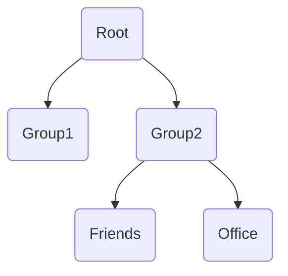
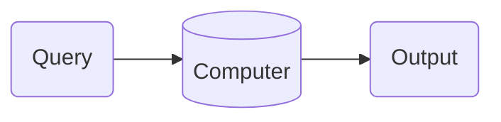

# Storing Data
- Once data has been collected, it needs to be stored.
- Storing data also helps us retrieve it easily and quickly
- A quality data storing strategy is crucial for data science
- Who makes data storage pipelines?
- What are the skills needed to maintain data storage pipelines?
## Things to Consider
- Have a data storing strategy in place *before* data collection
- Identify goals and necessities for data storage
- Identify the type of data you'll be storing
- Identify the size of the data you'll be storing
- **Avoid data fatigue**: storing data which is not helpful for your goals. It is costly and a waste of space/resources!
# File Type
- Comma-separated values (CSV)
- Tab-separated values (TSV)
- JSON (JavaScript Object Notation)
- XML (Extensible Markup Language)
- Microsoft Excel files (XLS, XLSX)
- SQLite DB files
- HDF5 (Hierarchical Data Format 5)
## CSV
- Literally just values separated by commas
```csv
ID,Name,Age,Country
1,Alice,30,USA
2,Bob,25,Canada 
3,Charlie,35,UK 
4,Diana,28,Germany 
5,Eric,22,France
```
```python
import pandas as pd

file_path = './your_file.csv'
data = pd.read_csv(file_path)

print(data)
```
## JSON
```json
[  
{"ID": 1, "Name": "Alice", "Age": 30, "Country": "USA"}, 
{"ID": 2, "Name": "Bob", "Age": 25, "Country": "Canada"}, 
{"ID": 3, "Name": "Charlie", "Age": 35, "Country": "UK"}, 
{"ID": 4, "Name": "Diana", "Age": 28, "Country": "Germany"}, {"ID": 5, "Name": "Eric", "Age": 22, "Country": "France"}
]
```
```python
import pandas as pd

file_path = './my-file.json'
data = pd.read_json(file_path)

print(data)
```
## HDF5
- HDF5 is a data model, library, and file format for storing and managing data
- Support many data formats, both separately or together (heterogeneous data)
- Designed to handle *large* and *complex* data
- *OS-independent* (aka cross platform)
- *Open format* (aka supported by Python, Matlab, R, etc.)
- *Self-describing*, which allows efficient extraction of metadata without needing metadata for the metadata (phew)
- Supports *data slicing* which is just extracting smaller portions of the data when needed. This is especially good if the largest dataset cannot be opened on a personal computer without some serious computing power
- Think of an HDF5 file like a container which is several datasets linked
	- Any type of data: images, text, tables, graphs, files, etc.
- Two important objects in HDF5 are '**groups**' and '**datasets**'
	- **Groups**: Like folders whose task is to organize the datasets
- Every HDF5 file has a group called '**root**'.
- We must have a path to everything (like a directory!)
### Writing into an HDF5 file
```python
# Importing libraries
import numpy as np
import h5py

# Creating two random matrices
matrix_1 = np.random.random(size(1000, 1000))
matrix_2 = np.random.random(size(1000, 1000))

# Open the file in write mode ('w'). 
# The file does not need to be closed manually
with h5py.File('./hdf5_data.h5', 'w') as hdf:
	# Using create_dataset() we write to matrices into the file
	# We name these matrices dataset1 and dataset2
	hdf.create_dataset('dataset1', data=matrix_1)
	hdf.create_dataset('dataset2', data=matrix_2)
```
### Reading from an HDF5 file
After we open an HDF5 file, we can treat it like a [dictionary in Python](https://www.w3schools.com/python/python_dictionaries.asp)
```python
# Open the previously written h5 file in read ('r') mode
with h5py.File('./hdf5_data.h5', 'r') as hdf:
	# Get keys to see what is in our h5 file
	ls = list(hdf.keys())
	print(ls)
	
	# Use .get() to read dataset1
	dataset1 = hdf.get('dataset1')
	print(type(dataset1))
	my_array = np.array(dataset1)
	print(type(my_array))
```
```terminal
['dataset1', 'dataset2']
<class 'h5py._hl.dataset.Dataset'>
<class 'numpy.ndarray'>
```
The "type" of dataset1 is Dataset, which is an internal file type of h5 files. We can convert it to `ndarray` using `np.ndarray(dataset1)`
### Groups and Subgroups in HDF5
As mentioned in [[#HDF5]], groups are just like folders in a computer.

We will create groups, and subgroups, and write some matrices inside the files. We'll organize the data according to the flowchart:

#### Creating Groups
```python
import numpy as np
import h5py

matrix_1 = np.random.random(size=(1000, 1000))
matrix_2 = np.random.random(size=(1000, 1000))
matrix_3 = np.random.random(size=(1000, 1000))
matrix_4 = np.random.random(size=(1000, 1000))

# Writing
with h5py.File('./hdf5_groups.h5', 'w') as hdf:
	# Create Group1
	G1 = hdf.create_group('/Group1')
	G1.create_dataset('dataset1', data=matrix_1)
	G1.create_dataset('dataset4', data=matrix_4)

	# Create Friends inside Group2
	G21 = hdf.create_group('Group2/Friends')
	G21.create_dataset('dataset3', data=matrix_3)
	
	# Create Office inside Group2
	G22 = hdf.create_group('Group2/Office')
	G22.create_dataset('dataset4', data=matrix_4)

# Reading
with h5py.File('./hdf5_groups.h5', 'r') as hdf:

	# Method 1: Access hierarchically
	items = list(hdf.items())
	print(items)
	G1 = hdf.get('/Group1')
	print(list(G1.items()))
	d1 = G1.get('dataset1')
	d1 = np.array(d1)
	print(d1.shape)
	d4 = G1.get('dataset4')
	d4 = np.array(d4)
	print(d4.shape)

	# Method 2: Access directly by providing the path
	d1_prime = hdf.get('Groups1/dataset1')
	d1_prime = np.array(d1_prime)
	d4_prime = hdf.get('Group1/dataset4')
	d4_prime = np.array(d4_prime)
	print(d1_prime.shape)
	print(d4_prime.shape)
```
```terminal
[('Group1', <HDF5 group "/Group1" (2 members)>), ('Group2', <HDF5 group "/Group2" (2 members) >)]
[('dataset1', <HDF5 dataset "dataset1": shape (1000, 1000), type "<f8">), ('dataset4', <HDF5 dataset "dataset4": shape (1000, 1000), type "<f8">)]
(1000, 1000)
(1000, 1000)
****************************************
(1000, 1000)
(1000, 1000)
```
### Compression in HDF5 Files
Datasets can become very large, very fast. Compression is crucial to reduce the dataset file while retaining all important information.
```python
G1.create_dataset('dataset1', data=matrix_1, compression='gzip', compression_opts=7)
```
The `compression` parameter determines the type of compression while the `compression_opts` is a GZIP functionality. The range is from 1-9, with 9 being the most compression.
#### Types of Compression in HDF5 Files
##### GZIP
- Available with HDF5 natively.
- Good compression, moderate speed.
- `compression_opts` sets the level of compression. 4 is default if left blank.
##### LZF 
- Available with h5py natively.
- Low to moderate compression, very fast.
- No options.
##### SZIP
- Patent-encumbered tool used in the NASA community.
- Not available with native HDF5 (legal limitations).
# Distributed Computing
The world is constantly storing, and transporting data. Petabytes of storage are needed for each major website we use. Millions of images are shared daily. This data needs to go somewhere. How can we store this much data, when a single computer has not been made that can handle such a load? The answer is [[#Distributed Computing]]!
- This is just a computer system distributed across several interconnected nodes. Nodes can be physical, or virtual.
- When a group of nodes work together on one task, we call it a **cluster**.
# Hadoop
*Refer to the slides for Hadoop setup in terminal*
- The **Apache Hadoop** project is an open-source software for distributed computing
- It is implemented in Java and inspired by [Google File System](https://en.wikipedia.org/wiki/Google_File_System)
- Hadoop consists of:
	- HDFS: Distributed File System
	- MapReduce
	- YARN (Yet Another Resource Negotiator)
## HDFS
- HDFS handles partitioning data across a cluster.
- HDFS uses data replication.
	- If one node shuts down, we still have the data in another node since several partitions were made.
### How does HDFS work?
![[Pasted image 20240221135105.png|350]]![[Pasted image 20240221135118.png|150]]
- NameNode keeps the metadata (which blocks of data in DataNodes represent a specific file). Blocks 1 and 2 are storing the input.txt file.
- HDFS replicates each block of data by a *replication factor*. Above, the replication factor is 2.
# SQL: Structured Query Language
- SQL is a programming language designed for working with databases.
- The hardest part of SQL is deciding which [pronunciation to use](https://learnsql.com/blog/sql-or-sequel/)
- SQL allows us to create, manipulate, share, write complex queries, from relational database management systems.
## "Query" a database
Query is a command we write in SQL to retrieve information or perform a specific operation, or operations, on the database. This includes inserting data, updating data, deleting data, comparing data, and so much more.

## Database Management Systems (DBMs)
- Basically a DBM is a software package (application) which is designed to perform queries.
- User interfaces make it easy for certain people to edit databases, and have access control.
	- SOLUS, which runs on ORACLE PeopleSoft, is a large database which stores all information about students. Only certain people are able to edit the database, which is an example of an authorized entity accessing the database.
- Some examples include:
- [MariaDB](https://mariadb.org/), [MS Access](https://www.microsoft.com/en-us/microsoft-365/access), [MySQL](https://www.mysql.com/), [ORACLE](https://www.oracle.com/ca-en/database/), [SQLite](https://www.sqlite.org/)
## SQL Syntax
SQL syntax consists of 4 languages (5 in this case)
### DDL - Data Definition Language
A set of statements which allow you to define or modify data structures and objects like tables:
- CREATE
- ALTER
- DROP
- TRUNCATE
- RENAME
### DML - Data Manipulation Language
The statements under DML allow the user to manipulate data in the tables of a database:
- SELECT
- INSERT
- UPDATE
- DELETE
### DCL - Data Control Language
DCL manages the rights that users have in the database:
- GRANT
- REVOKE
### TCL - Transaction Control Language
Manages transactions (changes) made to the database
- COMMIT
- ROLLBACK
- SAVEPOINT
### DQL - Data Query Language
Used to query or retrieve data from a table in the database
- SELECT
## Why *relational* databases?
- Relational databases store data in rows and columns, and allow links to be made between tables.
- Without relational databases, we would have to manually go from one database table to another if we wanted to access information related to our query that is not necessarily in the same table.
- f.e.: We access `Students` and would like to find out who their supervisor is. Since this is a relational database, the `supervisor_code` in the `Students` table directs us to the corresponding column in the `Supervisors` table.
![[Pasted image 20240221142322.png]]
## How to adopt a database?
1. Design the database
	- Consider the needs and resources
	- [Entity-Relationship Diagram](https://www.simplilearn.com/tutorials/sql-tutorial/ er-diagram-in-dbms)
1. Create the dataset using DDL
2. Manipulate it using DML
## Relational Schemas
- Relational schemas are diagrams used to describe a database
- We use them to design and code our database
### Primary Key and Foreign Key
- The primary key is a column or possibly a set of columns whose value can:
	- exist (not null)
	- are unique for each table
- The foreign key identifies the relationships between tables
### Data types in SQL
#### String data type
| Name | Syntax | Example |
| ---- | ---- | ---- |
| Character | CHAR() | CHAR(10) |
| Variable character | VARCHAR() | VARCHAR(5) |
| ENUM | ENUM() | ENUM('M', 'F') |
#### Numeric data type
| Name | Syntax | Example |
| ---- | ---- | ---- |
| Integer | TINYINT, SMALLINT, MEDIUMINT, INT, BIGINT |  |
| Fixed point | DECIMAL | DECIMAL(5,3) |
| Floating point | FLOAT, DOUBLR | FLOAT(5,3) |
#### Date, time, and files
| Name | Syntax | Example |
| ---- | ---- | ---- |
| Date | DATE | 2022-10-26 |
| Date time | DATETIME | 2022-10-26 12:38:01 |
| Timestamp | TIMESTAMP() | 1879812480 |
| Binary large object | BLOB |  |
## Some Constraints in SQL
- **NOT NULL**: If a field is specified as NOT NULL, you can't insert information in that field unless you provide a proper value for that.
- **AUTO_INCREMENT**: Automatically increases the value of a field when you insert information
- **PRIMARY KEY**: Illustrates the primary key of a table
- **FOREIGN KEY**: Highlights the foreign key of a table